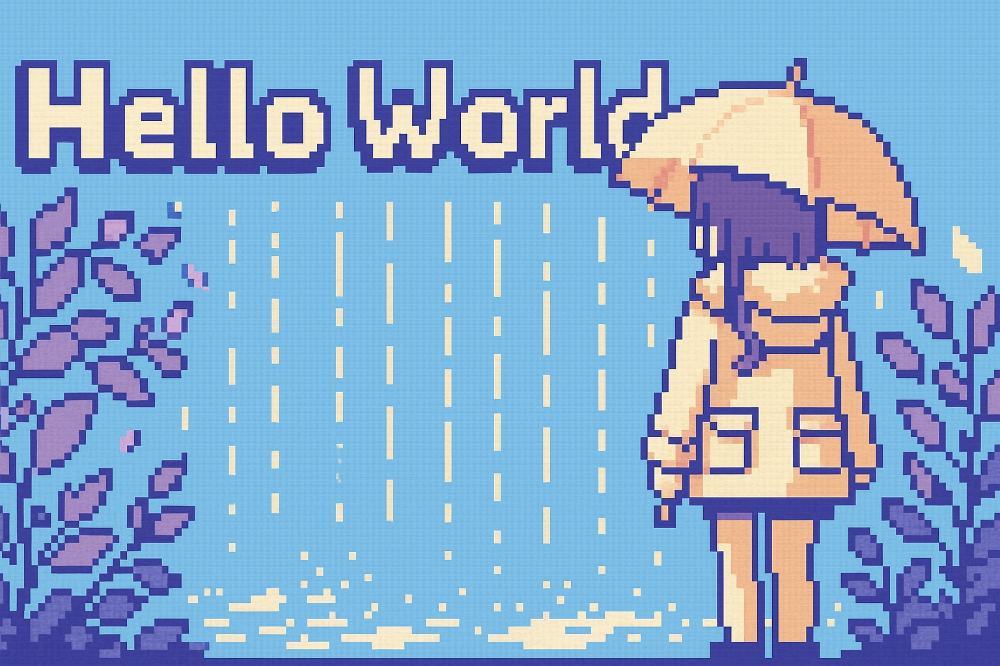

  

## 👋 Hi there

- I'm a Japanese Software Engineer
- Still learning and improving my skills every day
- I love playing card games

---

## 📊 GitHub Stats

   

---

## 🛠️ Skills

  
  
  
  
  

